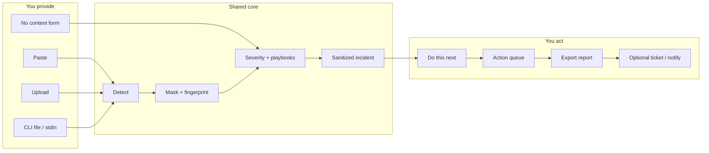
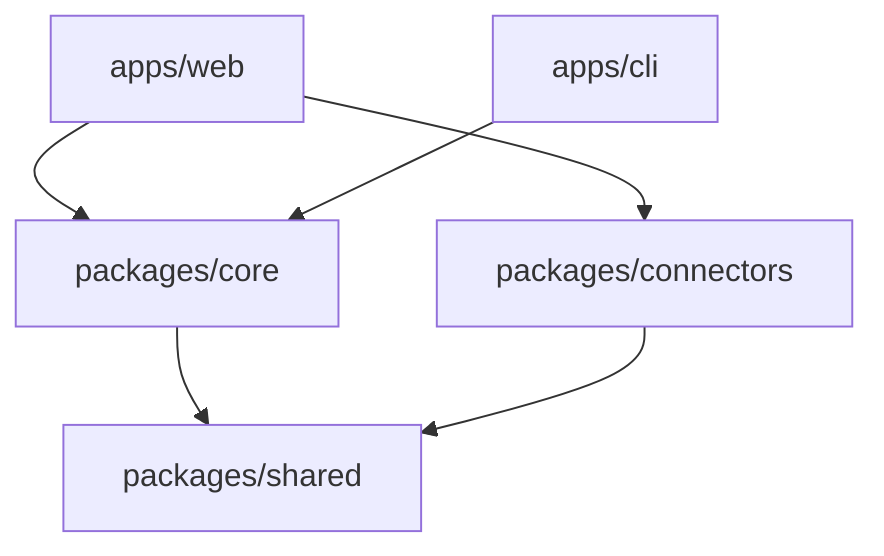

# Secret Exposure Response Assistant

<p align="center">
  <strong>Contain credential leaks without security expertise — and without ever showing the secret again.</strong>
</p>

<p align="center">
  <a href="#quick-start">Quick start</a> ·
  <a href="#how-it-works">How it works</a> ·
  <a href="#choose-your-path">Choose your path</a> ·
  <a href="#safety">Safety</a> ·
  <a href="#documentation">Docs</a> ·
  <a href="#production-checklist">Production checklist</a>
</p>

<p align="center">
  <code>Node ≥ 20</code> ·
  <code>pnpm ≥ 10</code> ·
  <code>Advisory + Assisted</code> ·
  <code>Local-first scan</code>
</p>

---

## What this is

When someone pastes a production `.env` into ChatGPT, commits an AWS key, or drops a database password into Slack, this tool:

1. **Detects** likely secrets in memory  
2. **Masks** them immediately (never displays raw values again)  
3. **Ranks** severity and builds a dependency-aware rotation plan  
4. **Helps** you track remediation, export a sanitized incident report, and optionally open Jira/ServiceNow or notify Slack/PagerDuty  

You do **not** need to classify credential formats or invent an incident-response plan.

---

## Table of contents

- [Quick start](#quick-start)
- [How it works](#how-it-works)
- [Choose your path](#choose-your-path)
  - [Web app](#web-app)
  - [CLI](#cli)
  - [Library API](#library-api)
- [Repository map](#repository-map)
- [Safety](#safety)
- [Connectors](#connectors)
- [Testing](#testing)
- [Configuration reference](#configuration-reference)
- [Production checklist](#production-checklist)
- [Documentation](#documentation)
- [Roadmap](#roadmap)
- [License](#license)

---

## Quick start

<details open>
<summary><strong>1. Install and verify</strong></summary>

```bash
cd "Security Assistant"
pnpm install
pnpm build
pnpm test
```

</details>

<details open>
<summary><strong>2a. Run the web app</strong></summary>

```bash
pnpm --filter @secret-response/web dev
```

Open [http://localhost:3000](http://localhost:3000) → paste or upload → review the plan → track actions.

</details>

<details open>
<summary><strong>2b. Or run the CLI</strong></summary>

```bash
pnpm --filter @secret-response/cli exec secret-response scan path/to/.env
pnpm --filter @secret-response/cli exec secret-response report --format markdown
pnpm --filter @secret-response/cli exec secret-response plan
```

| Exit | Meaning |
|------|---------|
| `0` | Clean |
| `1` | Secrets found |
| `2` | Error |

</details>

<details>
<summary><strong>Try the golden fixture (fake secrets only)</strong></summary>

```bash
pnpm --filter @secret-response/cli exec secret-response scan \
  packages/core/src/__tests__/fixtures/production.env
```

You should see **Critical**, multiple masked findings (AWS first in the plan), and **no** full secret values in the terminal.

</details>

---

## How it works



**Privacy boundary:** paste/upload scanning runs **in the browser** (or in the CLI process). Raw values are discarded after masking. Tickets and notifications receive **masked labels and metadata only**.

<details>
<summary><strong>Detection coverage</strong></summary>

| Family | Examples |
|--------|----------|
| AWS | Access key ID, secret access key |
| Stripe | Live/test secret, publishable, webhook-style |
| Auth | JWT-like secrets, PEM private keys |
| Data | Database URLs / credentials |
| Messaging | SMTP passwords |
| Generic | High-entropy tokens, common `.env` key names |

Confidence: `confirmed` · `high` · `possible` · `placeholder` · `non_secret`

</details>

<details>
<summary><strong>Playbook order (simplified)</strong></summary>

When multiple credential types appear together, remediation is ordered to reduce outage risk — for example create a **new** database credential and roll workloads **before** revoking the old password. JWT steps explicitly include **signing users out** because old tokens may still work after rotation.

Typical priority: AWS → PEM → Database → Stripe → JWT → SMTP → Generic API.

</details>

---

## Choose your path

### Web app

Interactive 3-step wizard for humans responding to an incident.

| Step | What you do |
|------|-------------|
| **1. Share details** | Paste, upload, or fill the guided form (Unknown allowed) |
| **2. Review plan** | See severity, masked findings, and **one** recommended next action |
| **3. Track progress** | Mark steps done, verify, export, optionally ticket/notify |

```bash
pnpm --filter @secret-response/web dev      # development
pnpm build && pnpm --filter @secret-response/web start   # production
```

Settings (header) stores optional connector credentials in localStorage. Prefer server env vars in production — see [`.env.example`](./.env.example).

Full walkthrough: [docs/USAGE.md](./docs/USAGE.md#web-app)

### CLI

Headless scanning for terminals and CI.

```bash
secret-response scan <path>          # or "-" for stdin
secret-response report --format json
secret-response plan
```

Session file stores the **sanitized** incident only (`SECRET_RESPONSE_SESSION_PATH` to override).

Full walkthrough: [docs/USAGE.md](./docs/USAGE.md#cli)

### Library API

```typescript
import {
  scanContent,
  buildIncidentFromScan,
  serializeIncidentMarkdown,
} from "@secret-response/core";

const { findings } = scanContent(text, { channel: "paste" });
const incident = buildIncidentFromScan(findings);
console.log(serializeIncidentMarkdown(incident)); // sanitized
```

More examples: [docs/USAGE.md](./docs/USAGE.md#core-library-api)

---

## Repository map

```text
apps/web                 Next.js UI + /api/connectors/*
apps/cli                 secret-response binary
packages/core            Detect · mask · severity · playbooks · incident
packages/shared          Types + Zod schemas
packages/connectors      Jira · ServiceNow · Slack · PagerDuty
docs/                    Architecture · Usage · Safety
.env.example             Connector / salt template (no secrets)
```



Deep dive: [docs/ARCHITECTURE.md](./docs/ARCHITECTURE.md)

---

## Safety

| Guarantee | How we enforce it |
|-----------|-------------------|
| No raw secrets in UI / CLI / tickets | Immediate masking + leak tests |
| Local-first detection | Browser / process memory; not uploaded for scanning |
| Sanitized connectors | `assertSafeOutboundPayload` before every send |
| Unknown ≈ production | Conservative severity when environment is unknown |
| Fingerprints, not values | Keyed HMAC (`SECRET_RESPONSE_FINGERPRINT_SALT`) |

**Never** paste real production secrets into issues, chat logs, or commit messages while debugging this repo. Use the golden fixtures under `packages/core/src/__tests__/fixtures/` (fake values only).

Rules for contributors: [docs/SAFETY.md](./docs/SAFETY.md)

---

## Connectors

Optional **assisted** mode. Unset = advisory-only (export still works).

| Connector | Purpose |
|-----------|---------|
| Jira | Create sanitized issue |
| ServiceNow | Create sanitized incident |
| Slack | Discreet channel notification |
| PagerDuty | Alert on Critical / High |

<details>
<summary><strong>Environment variables (summary)</strong></summary>

```bash
cp .env.example .env.local   # then fill values — do not commit .env.local

# Fingerprint salt (recommended in production)
SECRET_RESPONSE_FINGERPRINT_SALT=

# Jira
SECRET_RESPONSE_JIRA_BASE_URL=
SECRET_RESPONSE_JIRA_EMAIL=
SECRET_RESPONSE_JIRA_API_TOKEN=
SECRET_RESPONSE_JIRA_PROJECT_KEY=

# Slack / PagerDuty / ServiceNow — see .env.example
```

Complete reference: [packages/connectors/README.md](./packages/connectors/README.md)

</details>

---

## Testing

```bash
pnpm test                 # all packages
pnpm typecheck
pnpm build
```

| Package | What is covered |
|---------|-----------------|
| `core` | Detectors, golden `.env` / app-log fixtures, serializer leak properties |
| `cli` | Spawned process; stdout never contains fixture secrets |
| `connectors` | Mocked `fetch`; outbound body leak guards |
| `web` | Export helpers leak guards |

---

## Configuration reference

| Variable | Used by | Purpose |
|----------|---------|---------|
| `SECRET_RESPONSE_FINGERPRINT_SALT` | core / web / cli | Stable HMAC salt for fingerprints |
| `SECRET_RESPONSE_SESSION_PATH` | cli | Path for sanitized last-scan session |
| `SECRET_RESPONSE_JIRA_*` | connectors / web API | Jira assisted tickets |
| `SECRET_RESPONSE_SERVICENOW_*` | connectors / web API | ServiceNow assisted tickets |
| `SECRET_RESPONSE_SLACK_WEBHOOK_URL` | connectors / web API | Slack notify |
| `SECRET_RESPONSE_PAGERDUTY_ROUTING_KEY` | connectors / web API | PagerDuty (Critical/High) |

Template: [`.env.example`](./.env.example)

---

## Production checklist

Use this before exposing the app beyond a local workstation.

<details>
<summary><strong>Click to expand checklist</strong></summary>

- [ ] Node 20+ and locked `pnpm` version via Corepack  
- [ ] `pnpm build && pnpm test && pnpm typecheck` green in CI  
- [ ] `SECRET_RESPONSE_FINGERPRINT_SALT` set to a long random secret (not committed)  
- [ ] Connector tokens only on the **server** (env / secret manager), not in client bundles  
- [ ] TLS terminated in front of the Next.js process  
- [ ] Restrict who can reach `/api/connectors/*` (auth / network policy)  
- [ ] Log redaction: never log request bodies that might include paste content  
- [ ] Operators trained: **do not** re-paste secrets into Slack/Jira while using this tool  
- [ ] Runbook link: [docs/USAGE.md](./docs/USAGE.md) + [docs/SAFETY.md](./docs/SAFETY.md)  
- [ ] Confirm advisory-only expectation: v1 does **not** rotate cloud keys automatically  

</details>

---

## Documentation

| Doc | Contents |
|-----|----------|
| [docs/ARCHITECTURE.md](./docs/ARCHITECTURE.md) | Monorepo layout, data-flow & trust-boundary diagrams |
| [docs/USAGE.md](./docs/USAGE.md) | Web, CLI, connectors, scenarios, troubleshooting |
| [docs/SAFETY.md](./docs/SAFETY.md) | Never-reproduce-secrets rules for humans and agents |
| [packages/connectors/README.md](./packages/connectors/README.md) | Connector API and env vars |
| [`.env.example`](./.env.example) | Safe configuration template |

<details>
<summary><strong>Monorepo scripts</strong></summary>

```bash
pnpm build       # Build all packages (Turborepo)
pnpm dev         # Dev tasks (web)
pnpm test        # All package tests
pnpm typecheck   # Typecheck all packages
pnpm lint        # Lint where configured
```

</details>

---

## Roadmap

| Version | Focus |
|---------|--------|
| **v1 (current)** | Paste/upload/guided scan, plans, export, assisted tickets/notify, CLI |
| **v2** | GitHub / Slack / CI / AI-conversation connectors, ownership lookup, prepared commands |
| **v3** | Approved automated rotation, redeploy hooks, session invalidation, auto-verification |

---

## License

Private — internal use.
