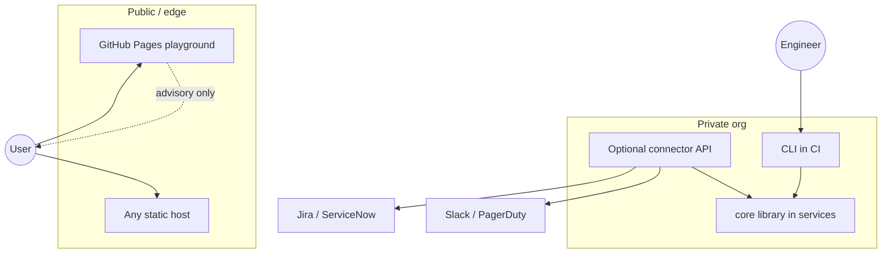
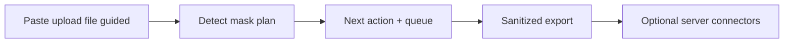
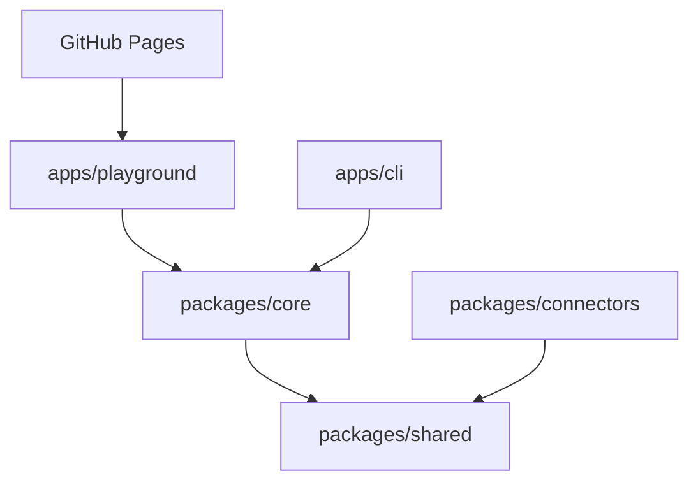

# Secret Response

<p align="center">
  <strong>Contain exposed credentials without showing the secret again.</strong>
</p>

<p align="center">
  <a href="#deploying-this-repo-to-github-pages"><strong>Live playground</strong></a>
  ·
  <a href="#production-usage">Production usage</a>
  ·
  <a href="#quick-start">Quick start</a>
  ·
  <a href="#architecture">Architecture</a>
</p>

<p align="center">
  <code>Vite playground</code> ·
  <code>CLI</code> ·
  <code>Local-first scan</code> ·
  <code>Advisory + Assisted connectors</code>
</p>

> **Recommended GitHub repo name:** `secret-response`  
> **Pages URL:** `https://amulyavarshney.github.io/<repo-name>/` (must match the repository name exactly)  
> Rename on GitHub if needed: **Settings → General → Repository name** → `secret-response`

---

## What this product is

When someone pastes a production `.env` into an AI chat, commits an AWS key, or drops a database password into Slack, **Secret Response** helps them:

1. Detect likely secrets **in memory**
2. Mask them immediately (`AWS access key ending in …K92P`)
3. Rank severity and produce a dependency-aware rotation plan
4. Track remediation, export a sanitized report, and (optionally) open tickets / notify responders

Operators do **not** need to classify credential formats or invent an IR plan from scratch.

---

## Production usage



| Mode | When to use | Where it runs | Side effects |
|------|-------------|---------------|--------------|
| **Playground (static)** | Training, dry-runs, personal incidents, public demo | GitHub Pages / Vite static host | None — scan in browser, export report |
| **CLI** | Gate PRs/pipelines, scan files on disk | CI runners / laptops | Exit `1` if secrets found; sanitized session file only |
| **Core library** | Embed in your own tools | Node or browser bundles | Your code owns persistence |
| **Assisted connectors** | Open sanitized tickets / alerts | **Your** backend (not Pages) | Jira, ServiceNow, Slack, PagerDuty |

### Recommended production topologies

<details open>
<summary><strong>A. Advisory static site (this repo’s default deploy)</strong></summary>

- Build the Vite playground with `GITHUB_PAGES=true`
- Host on GitHub Pages or any CDN
- Users paste/upload locally; raw secrets never leave the browser for scanning
- Export Markdown/JSON into your existing incident process

Best for: security awareness, on-call playbooks, public demos.

</details>

<details>
<summary><strong>B. CLI in CI (fail closed)</strong></summary>

```bash
pnpm --filter @secret-response/cli exec secret-response scan path/to/file
# exit 0 clean · 1 secrets found · 2 error
```

Best for: blocking commits that still contain high-entropy credentials (defense in depth alongside gitleaks/trufflehog).

</details>

<details>
<summary><strong>C. Assisted response behind your API</strong></summary>

1. Run detection with `@secret-response/core` (or accept a sanitized `Incident` from the playground export)
2. Call `@secret-response/connectors` **only from a trusted server** with org credentials in a secret manager
3. Never forward raw paste buffers to tickets or Slack

Best for: SOC / platform teams that want Jira + PagerDuty without retyping context.

</details>

### Production hard rules

- Prefer **server-side** connector credentials — do not ship API tokens in a static site
- Set `SECRET_RESPONSE_FINGERPRINT_SALT` to a long random value in any long-lived deployment that stores fingerprints
- Treat unknown environment as **production** (built-in conservative severity)
- v1 does **not** rotate cloud keys or validate live credentials against providers

### Production checklist

- [ ] Node 20+ and locked pnpm via Corepack
- [ ] `pnpm build && pnpm test && pnpm typecheck` green in CI
- [ ] Playground hosted over HTTPS (GitHub Pages or CDN)
- [ ] Fingerprint salt set for any long-lived fingerprint storage
- [ ] Connector tokens only on a trusted server (never in the static playground)
- [ ] Operators trained not to re-paste raw secrets into tickets/chat
- [ ] Advisory vs assisted mode expectations documented for your org

---

## What it can do (v1)

| Capability | Playground | CLI | Connectors lib |
|------------|:----------:|:---:|:--------------:|
| Paste / upload / guided scan | yes | file/stdin | — |
| Mask + severity + playbooks | yes | yes | — |
| Track actions / verification | yes | plan/report | — |
| Export sanitized Markdown/JSON | yes | yes | — |
| Create Jira / ServiceNow issues | — | — | yes (server) |
| Slack / PagerDuty notify | — | — | yes (server) |



---

## Quick start

### Prerequisites

- Node.js ≥ 20  
- pnpm ≥ 10 (`corepack enable`)

### Install & verify

```bash
pnpm install
pnpm build
pnpm test
pnpm typecheck
```

### Playground (local)

```bash
pnpm dev:playground
# → http://localhost:5173
```

### Playground (GitHub Pages build)

```bash
GITHUB_PAGES=true PAGES_BASE=/secret-response/ pnpm build:playground
pnpm --filter @secret-response/playground preview
```

### CLI demo (golden fixture, push-safe)

```bash
pnpm demo:scan
```

---

## Architecture

```text
apps/playground     Vite + React playground (GitHub Pages)
apps/cli            secret-response CLI
packages/core       Detect · mask · severity · playbooks · incident
packages/shared     Types + Zod schemas
packages/connectors Jira · ServiceNow · Slack · PagerDuty (server-side)
docs/               Architecture · Usage · Safety
.github/workflows/  Pages deploy
```



Deep dive: [docs/ARCHITECTURE.md](./docs/ARCHITECTURE.md)

---

## Safety

| Guarantee | How |
|-----------|-----|
| No raw secrets in UI / CLI / tickets | Immediate masking + leak tests |
| Local-first detection | Browser / process memory |
| Sanitized connectors | `assertSafeOutboundPayload` before send |
| Push-safe fixtures | Stripe keys assembled / placeholder-expanded at test time |

See [docs/SAFETY.md](./docs/SAFETY.md).

---

## Deploying this repo to GitHub Pages

Deployment is **from this repository only** (not from `amulyavarshney.github.io`).

1. Ensure the GitHub repo name matches the Pages path you want (recommended: `secret-response`)
2. **Settings → Pages → Build and deployment → Source: GitHub Actions**
3. Push to `main` — workflow [`.github/workflows/deploy-pages.yml`](./.github/workflows/deploy-pages.yml) builds the playground and deploys
4. Site URL: `https://amulyavarshney.github.io/<repo-name>/`

The workflow sets `PAGES_BASE` from `github.event.repository.name`, so renaming the repo updates the asset base path automatically.

---

## Configuration

| Variable | Purpose |
|----------|---------|
| `SECRET_RESPONSE_FINGERPRINT_SALT` | HMAC salt for fingerprints |
| `SECRET_RESPONSE_SESSION_PATH` | CLI sanitized session path |
| `SECRET_RESPONSE_JIRA_*` / `SERVICENOW_*` / `SLACK_*` / `PAGERDUTY_*` | Server-side connectors — see [packages/connectors/README.md](./packages/connectors/README.md) |
| `GITHUB_PAGES` / `PAGES_BASE` | Playground static build for Pages |

Template: [`.env.example`](./.env.example)

---

## Documentation

| Doc | Contents |
|-----|----------|
| [docs/ARCHITECTURE.md](./docs/ARCHITECTURE.md) | Design diagrams |
| [docs/USAGE.md](./docs/USAGE.md) | Day-to-day usage |
| [docs/SAFETY.md](./docs/SAFETY.md) | Never-reproduce-secrets rules |
| [packages/connectors/README.md](./packages/connectors/README.md) | Connector env + API |

---

## Roadmap

| Version | Focus |
|---------|--------|
| **v1 (current)** | Playground, CLI, sanitized plans/export, connector library |
| **v2** | Source connectors (GitHub/Slack/CI), ownership lookup |
| **v3** | Approved automated rotation + verification |

---

## License

Private — internal / personal use.
