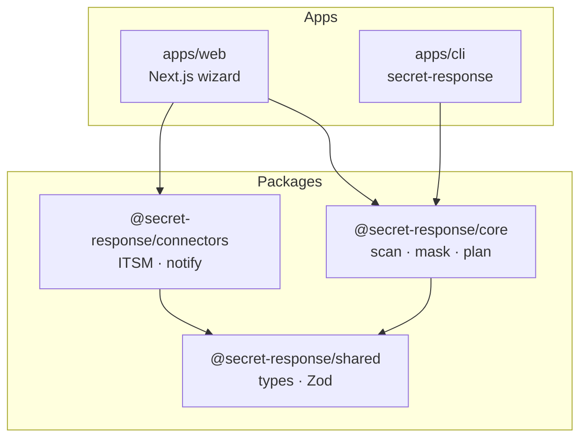
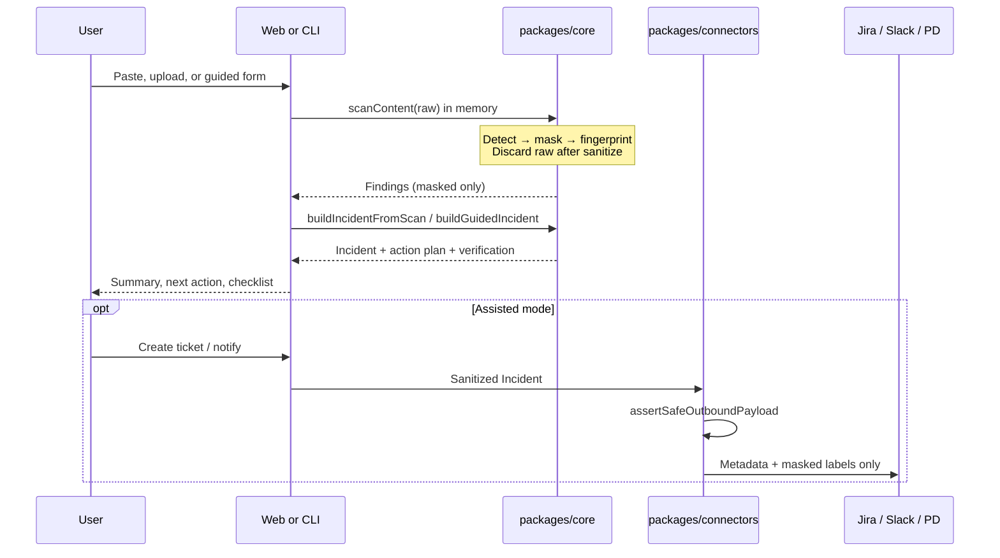
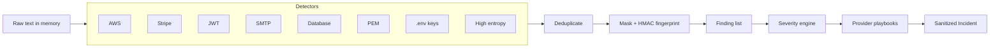
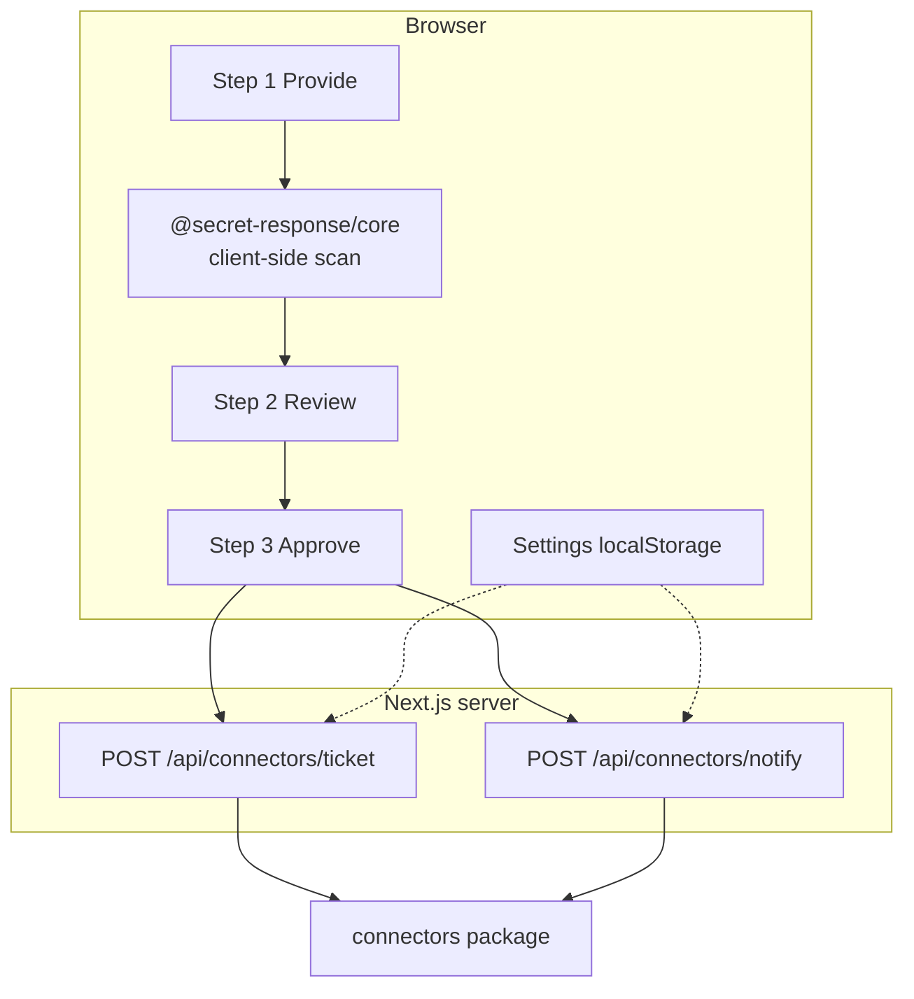
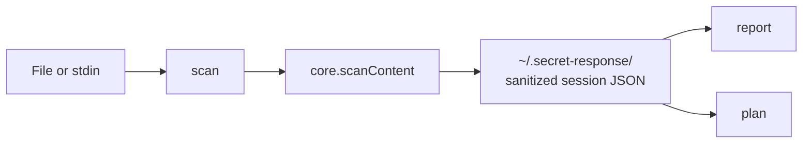
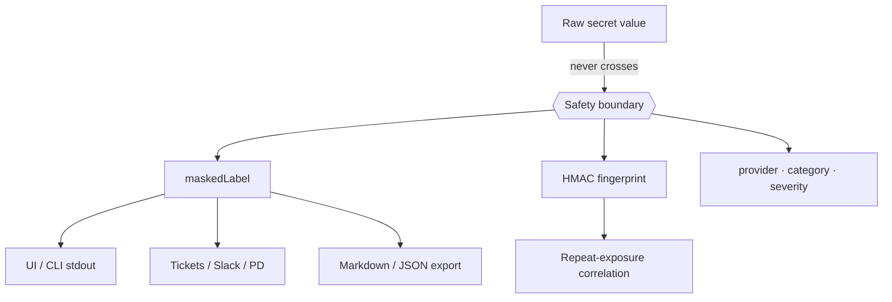

# Architecture

This document describes how the Secret Exposure Response Assistant is structured, how data flows through a scan, and how safety boundaries are enforced.

## Goals

| Goal | Implementation |
|------|----------------|
| Fast response under stress | One recommended next action + ordered plan |
| Zero secret echo | Mask immediately; leak tests on all serializers |
| Shared logic | Web and CLI call the same `@secret-response/core` |
| Progressive automation | v1 is advisory + assisted (tickets/notify only) |

## Monorepo layout

```text
Security Assistant/
├── apps/
│   ├── web/                 # Next.js App Router UI + connector API routes
│   └── cli/                 # secret-response CLI (scan / report / plan)
├── packages/
│   ├── core/                # Detect → mask → severity → playbooks → incident
│   ├── shared/              # Shared TypeScript types + Zod schemas
│   └── connectors/          # Jira, ServiceNow, Slack, PagerDuty adapters
├── docs/
│   ├── ARCHITECTURE.md      # This file
│   ├── USAGE.md             # How to run and operate
│   └── SAFETY.md            # Never-reproduce-secrets rules
├── package.json             # pnpm + Turborepo root
├── pnpm-workspace.yaml
└── turbo.json
```

## Package responsibilities



| Package | Role |
|---------|------|
| `@secret-response/shared` | Canonical `Incident`, `Finding`, `RemediationAction` types and Zod validation |
| `@secret-response/core` | Detectors, masking, HMAC fingerprints, severity, playbooks, incident builders, serializers |
| `@secret-response/connectors` | Sanitized outbound adapters + `assertSafeOutboundPayload` |
| `@secret-response/web` | 3-step UX; client-side scan; API routes for connectors only |
| `@secret-response/cli` | File/stdin scan; session persistence of **sanitized** incident only |

## End-to-end data flow



## Detection pipeline



### Confidence labels

| Label | Meaning |
|-------|---------|
| `confirmed` | Strong format match (e.g. `AKIA…`, `sk_live_…`) |
| `high` | Strong contextual / entropy signal |
| `possible` | Needs owner review |
| `placeholder` | Looks like a known example / dummy |
| `non_secret` | Treated as not a secret |

### Severity

Severity is derived from **effective environment × secret type × channel**.

- Unknown environment is treated as **production** (conservative).
- Live Stripe / AWS / DB / PEM in production → typically **Critical**.
- Guided “no content” path with unknown env → **Critical** containment checklist.

## Playbook ordering

Actions are dependency-aware. Typical priority when multiple providers are present:

1. **AWS** — inventory → create replacement → update stores → deactivate old key  
2. **PEM / TLS** — new key pair → deploy → revoke old  
3. **Database** — create new → update store → roll workloads → verify → revoke old  
4. **Stripe** — roll key → update services → review API activity → revoke  
5. **JWT** — replace signing secret → **sign users out / invalidate tokens**  
6. **SMTP** — rotate → review outbound volume / reputation  
7. **Generic API** — revoke and reissue  

Each action includes: order, why, impact, permissions, suggested owner role, admin deep link (when known), verification steps, status.

## Web architecture



**Privacy boundary:** Detection runs in the browser. Server routes accept only a Zod-validated `Incident` (already sanitized). Raw paste/upload content is not posted to the server for scanning.

## CLI architecture



| Exit code | Meaning |
|-----------|---------|
| `0` | No secrets found |
| `1` | Secrets found (findings present) |
| `2` | Usage or runtime error |

## Safety boundaries



See [SAFETY.md](./SAFETY.md) for contributor rules and test requirements.

## Modes (v1)

| Mode | Behavior |
|------|----------|
| **Advisory** | Detect, plan, export — no external side effects |
| **Assisted** | Open tickets / send notifications with sanitized payloads |
| **Controlled automation** | *Out of scope for v1* (no key rotation via provider APIs) |

## Extension points (v2+)

- Source connectors (GitHub commit, Slack message, CI log fetch)
- Ownership lookup and secret-manager deep links
- Approved rotation actions with audit trail
- Browser / IDE / Slack message actions
