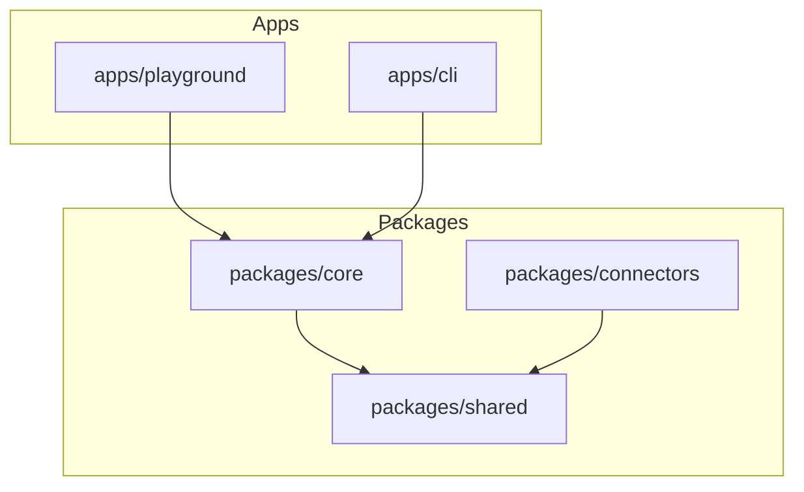
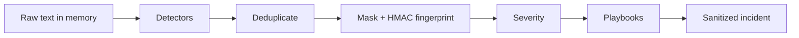
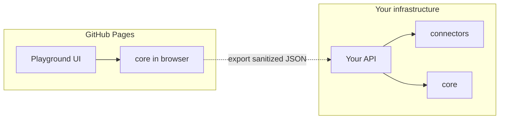

# Architecture

## Goals

| Goal | Implementation |
|------|----------------|
| Fast response under stress | One recommended next action + ordered plan |
| Zero secret echo | Mask immediately; leak tests on serializers |
| Shared logic | Playground and CLI share `@secret-response/core` |
| Static public demo | Vite playground on GitHub Pages (advisory) |
| Progressive automation | Connectors library for **server-side** assisted mode |

## Monorepo layout

```text
apps/playground   Vite + React UI (Pages + local)
apps/cli          secret-response CLI
packages/core     Detect → mask → severity → playbooks → incident
packages/shared   Types + Zod
packages/connectors  Jira / ServiceNow / Slack / PagerDuty
```



## Detection pipeline



## Production vs playground



Playground never holds org connector secrets. Assisted ticket/notify flows belong on a trusted backend that consumes a sanitized `Incident`.

## Playbook priority

AWS → PEM → Database → Stripe → JWT (include session invalidation) → SMTP → Generic API

## Related

- [USAGE.md](./USAGE.md)
- [SAFETY.md](./SAFETY.md)
- [../README.md](../README.md)
