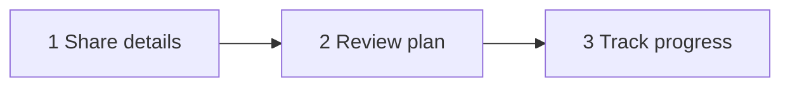

# Usage Guide

Practical instructions for installing, running, and operating the Secret Exposure Response Assistant.

## Prerequisites

- **Node.js** ≥ 20
- **pnpm** ≥ 10 (`corepack enable && corepack prepare pnpm@10.12.1 --activate`)

## Install

```bash
git clone <repo-url> "Security Assistant"
cd "Security Assistant"
pnpm install
pnpm build
pnpm test
```

Expected: all packages build; ~49 tests pass.

---

## Web app

### Development

```bash
pnpm --filter @secret-response/web dev
# → http://localhost:3000
```

### Production

```bash
pnpm build
pnpm --filter @secret-response/web start
# Optional: PORT=3456 pnpm --filter @secret-response/web exec next start -p 3456 -H 127.0.0.1
```

### Three-step workflow



<details>
<summary><strong>Step 1 — Share details</strong></summary>

| Tab | When to use |
|-----|-------------|
| **Paste** | You still have the message, `.env`, or log snippet |
| **Upload** | Drag-and-drop `.env`, `.txt`, `.log`, `.json`, `.yaml`/`.yml`, `.properties`, shell, Terraform, K8s, CI configs |
| **No content** | You know an exposure happened but no longer have the text |
| **Link** | Placeholder for future GitHub / Slack / ticket connectors |

Before scanning, confirm you have **not** edited or reformatted the content. Reformatting can hide detections.

Scanning runs **in the browser**. Raw values are masked immediately and not sent to the server for detection.

</details>

<details>
<summary><strong>Step 2 — Review plan</strong></summary>

You should see:

1. Severity (Critical / High / Medium / Low)
2. Masked findings (never full secret values)
3. **Do this next** — the single recommended first action
4. Full prioritized action queue
5. Optional progressive questions (environment, outage, open incident) when answers change the plan

</details>

<details>
<summary><strong>Step 3 — Track progress</strong></summary>

- Mark actions `pending` → `done` / `skipped`
- Assign owners (plain-text role or name — no secrets)
- Complete verification checklist items
- Export sanitized Markdown or JSON
- Optionally create a Jira/ServiceNow ticket or notify Slack/PagerDuty

Incident state is held in memory for the session (lost on refresh by design).

</details>

### Settings

Open **Settings** in the header to configure:

- Reporter display name
- Fingerprint salt (optional; prefer server env in production)
- Jira / ServiceNow / Slack / PagerDuty credentials

Credentials in Settings are stored in **browser localStorage**. For production deployments, prefer **server-side environment variables** so tokens are not held in the browser.

---

## CLI

Build once, then invoke the binary:

```bash
pnpm --filter @secret-response/cli build
pnpm --filter @secret-response/cli exec secret-response --help
```

### Commands

```bash
# Scan a file
secret-response scan path/to/.env

# Scan stdin
cat path/to/.env | secret-response scan -
# or
secret-response scan -

# Sanitized report from last scan
secret-response report --format markdown
secret-response report --format json

# Prioritized action list from last scan
secret-response plan
```

Via pnpm from the monorepo root:

```bash
pnpm --filter @secret-response/cli exec secret-response scan packages/core/src/__tests__/fixtures/production.env
```

### Exit codes

| Code | Meaning |
|------|---------|
| `0` | Clean — no secrets detected |
| `1` | Secrets found |
| `2` | Error (missing file, bad args, I/O) |

### Session file

After a successful `scan`, a **sanitized** incident is written to:

- Default: `~/.secret-response/last-session.json` (path may vary; override with env)
- Override: `SECRET_RESPONSE_SESSION_PATH=/tmp/sera-session.json`

The session never stores raw secret values — only masked findings and remediation metadata.

### CI example

```bash
#!/usr/bin/env bash
set -euo pipefail
pnpm --filter @secret-response/cli exec secret-response scan .env.production
# exit 1 → fail the job if secrets are present
```

---

## Connectors (assisted mode)

Connectors are optional. Without them, the product stays in **advisory** mode (detect + plan + export).

| Connector | Action |
|-----------|--------|
| Jira | Create sanitized issue |
| ServiceNow | Create sanitized incident |
| Slack | Post discreet notification (categories + link) |
| PagerDuty | Alert on Critical / High only |

Full variable reference: [packages/connectors/README.md](../packages/connectors/README.md).

### Minimal server env example

```bash
# Fingerprints
export SECRET_RESPONSE_FINGERPRINT_SALT="$(openssl rand -hex 32)"

# Jira
export SECRET_RESPONSE_JIRA_BASE_URL="https://your-org.atlassian.net"
export SECRET_RESPONSE_JIRA_EMAIL="security-bot@example.com"
export SECRET_RESPONSE_JIRA_API_TOKEN="..."
export SECRET_RESPONSE_JIRA_PROJECT_KEY="SEC"

# Slack
export SECRET_RESPONSE_SLACK_WEBHOOK_URL="https://hooks.slack.com/services/..."

# PagerDuty
export SECRET_RESPONSE_PAGERDUTY_ROUTING_KEY="..."
```

Then start the web app; use **Create ticket** / **Notify** on step 3.

---

## Core library API

Use from Node scripts or future integrations:

```typescript
import {
  scanContent,
  buildIncidentFromScan,
  buildGuidedIncident,
  serializeIncidentMarkdown,
  serializeIncidentJson,
} from "@secret-response/core";

const { findings } = scanContent(rawText, {
  channel: "file_upload",
  filename: ".env.production",
});

const incident = buildIncidentFromScan(findings, {
  channel: "paste",
  environment: "production",
  application: "billing-api",
  reporter: "alice",
});

// Never contains raw secrets
console.log(serializeIncidentMarkdown(incident));
console.log(serializeIncidentJson(incident));

// No original content available
const guided = buildGuidedIncident({
  channel: "ai_assistant",
  environment: "unknown",
  systems: ["AWS", "Postgres", "Stripe"],
  stillAccessible: "unknown",
  regulatedData: "unknown",
});
```

---

## Common scenarios

<details>
<summary><strong>I pasted a production .env into an AI chat</strong></summary>

1. Open the web app → **Paste** or **Upload** the same file (do not edit it).
2. Confirm the checkbox → **Scan content**.
3. Follow **Do this next** (usually disable/replace the AWS key first).
4. Export the report or open a security ticket from step 3.
5. Work the verification checklist until old credentials are confirmed revoked.

</details>

<details>
<summary><strong>I no longer have the original text</strong></summary>

1. Use the **No content** tab.
2. Answer what you know; leave the rest as **Unknown**.
3. Follow the conservative containment checklist (treated as production when unknown).

</details>

<details>
<summary><strong>I want to scan in CI without a UI</strong></summary>

```bash
pnpm build
pnpm --filter @secret-response/cli exec secret-response scan path/to/file
```

Fail the pipeline on exit code `1`. Do not echo the file contents in CI logs if they may contain secrets.

</details>

<details>
<summary><strong>Is this string a real secret?</strong></summary>

Paste it into the web app or CLI. Review the **confidence** label:

- `confirmed` / `high` → treat as real; rotate
- `possible` → owner review; prefer rotation when unsure
- `placeholder` / `non_secret` → still verify with the owner before dismissing

The tool does **not** call external APIs to validate live credentials in v1.

</details>

---

## Troubleshooting

| Symptom | Likely cause | Fix |
|---------|--------------|-----|
| `Scan content` disabled | Checkbox not checked / empty paste | Confirm “I have not edited…” and paste content |
| Ticket button errors | Missing connector config | Set Settings or server env vars |
| `report` / `plan` fail | No prior successful `scan` | Run `scan` first; check `SECRET_RESPONSE_SESSION_PATH` |
| pnpm not found | Corepack not enabled | `corepack enable && corepack prepare pnpm@10.12.1 --activate` |
| Next start network error in sandbox | Restricted environment | Run with host networking / outside sandbox |

---

## Related docs

- [ARCHITECTURE.md](./ARCHITECTURE.md) — system design and diagrams
- [SAFETY.md](./SAFETY.md) — never-reproduce-secrets rules
- [packages/connectors/README.md](../packages/connectors/README.md) — connector env and API
- [../README.md](../README.md) — interactive overview and quick start
